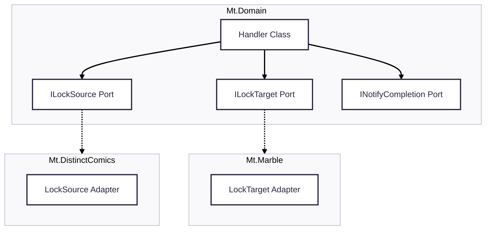
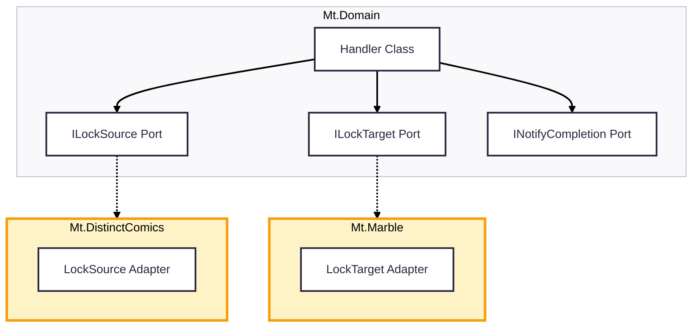

# Find a weakness
```csharp 
// Mt.Domain.ILockSource
public interface ILockSource
{
    Response Handle(long migrationId);

    public abstract record Response
    {
        public sealed record Locked : Response;
        public sealed record Faulted(string Reason) : Response;
    }
}

// Mt.Domain.Handler
var action = lockSource.Handle(migrationId) switch
{
    ILockSource.Response.Faulted(var reason) => $"⏰ Lock faulted ({reason}) — scheduling retry",
    _ => $"✅ Source locked — advancing migration {migrationId} to Transform",
};
```

---
layout: center
---

# How Exciting New C# Features Make Our Code Explicit

## `closed` hierarchies & `union` types in .NET 11

<br>

*your name — your event, 2026*

<!--
[0:05] NOW introduce yourself — 30 seconds max, the audience already has the problem in their heads.

Frame the promise: "In the next 35 minutes: why that underscore is *required* today, what it costs us in reading and in evolution, and two brand-new C# constructs — closed hierarchies and union types — that each remove it. By the end you'll know exactly which one to reach for, because they are NOT the same feature."

Mention: everything shown today is in one repo — code, demos, these slides — link on the last slide. .NET 11 preview 6, so one disclaimer: syntax may still shift before November.
-->

--- 
---

# Migrate Distinct Comics heroes to Marble
- Marble has bought Distinct Comics 
- Our job is to migrate heroes from Distinct Comics to Marble

---

# Migration Tool Architecture



---

# Find a weakness
```csharp {all|17}
// Mt.Domain.ILockSource
public interface ILockSource
{
    Response Handle(long migrationId);

    public abstract record Response
    {
        public sealed record Locked : Response;
        public sealed record Faulted(string Reason) : Response;
    }
}

// Mt.Domain.Handler
var action = lockSource.Handle(migrationId) switch
{
    ILockSource.Response.Faulted(var reason) => $"⏰ Lock faulted ({reason}) — scheduling retry",
    _ => $"✅ Source locked — advancing migration {migrationId} to Transform",
};
```

---

# So let's make it explicit

```csharp {17}
// Mt.Domain.ILockSource
public interface ILockSource
{
    Response Handle(long migrationId);

    public abstract record Response
    {
        public sealed record Locked : Response;
        public sealed record Faulted(string Reason) : Response;
    }
}

// Mt.Domain.Handler
var action = lockSource.Handle(migrationId) switch
{
    ILockSource.Response.Faulted(var reason) => $"⏰ Lock faulted ({reason}) — scheduling retry",
    _ => $"✅ Source locked — advancing migration {migrationId} to Transform",
};
```

---

# So let's make it explicit

```csharp {17|all}
// Mt.Domain.ILockSource
public interface ILockSource
{
    Response Handle(long migrationId);

    public abstract record Response
    {
        public sealed record Locked : Response;
        public sealed record Faulted(string Reason) : Response;
    }
}

// Mt.Domain.Handler
var action = lockSource.Handle(migrationId) switch
{
    ILockSource.Response.Locked => $"✅ Source locked — advancing migration {migrationId} to Transform",
    ILockSource.Response.Faulted(var reason) => $"⏰ Lock faulted ({reason}) — scheduling retry",
};
```

---

# So let's make it explicit
```csharp
// Mt.Domain.ILockSource
public interface ILockSource
{
    Response Handle(long migrationId);

    public abstract record Response
    {
        public sealed record Locked : Response;
        public sealed record Faulted(string Reason) : Response;
    }
}

// Mt.Domain.Handler
var action = lockSource.Handle(migrationId) switch
//                                          ~~~~~~
// error CS8509: The switch expression does not handle all possible values
// of its input type (it is not exhaustive).
{
    ILockSource.Response.Locked => $"✅ Source locked — advancing migration {migrationId} to Transform",
    ILockSource.Response.Faulted(var reason) => $"⏰ Lock faulted ({reason}) — scheduling retry",
};
```

---

# So let's make it explicit
```csharp {18}
// Mt.Domain.ILockSource
public interface ILockSource
{
    Response Handle(long migrationId);

    public abstract record Response
    {
        public sealed record Locked : Response;
        public sealed record Faulted(string Reason) : Response;
    }
}

// Mt.Domain.Handler
var action = lockSource.Handle(migrationId) switch
{
    ILockSource.Response.Locked => $"✅ Source locked — advancing migration {migrationId} to Transform",
    ILockSource.Response.Faulted(var reason) => $"⏰ Lock faulted ({reason}) — scheduling retry",
    _ => throw new ArgumentOutOfRangeException(nameof(migrationId), migrationId, null),
};
```

---

# Why is the `_` even there?

```csharp
// Mt.Domain.ILockSource
public interface ILockSource
{
    Response Handle(long migrationId);

    public abstract record Response
    {
        public sealed record Locked : Response;
        public sealed record Faulted(string Reason) : Response;
    }
}

// Mt.Domain.Handler
var action = lockSource.Handle(migrationId) switch
{
    ILockSource.Response.Locked => $"✅ Source locked — advancing migration {migrationId} to Transform",
    ILockSource.Response.Faulted(var reason) => $"⏰ Lock faulted ({reason}) — scheduling retry",
    _ => throw new ArgumentOutOfRangeException(nameof(migrationId), migrationId, null),
};
```

<!--
[0:06] Key teaching moment — the underscore is not laziness, it is REQUIRED.

"Response is a public abstract record. Any assembly — another project in this solution, a NuGet package — can derive from it. So when I switch over it, the compiler is RIGHT: my two named cases don't cover everything, because the set of cases is open. The underscore isn't sloppiness. It's the only honest answer to a type that can't state its own boundaries."

"The switch was never the problem. The TYPE is the problem — it's open, and my domain is closed. The language just had no way to say so. Until now."

Last click — the foreshadow: "And before you file this under 'adapter problem': the Result type — completed-or-failed, the one every handler here returns — has the exact same shape, and its combinators carry the exact same underscore. We'll come back to it; it gets its own feature."
-->

---

# Migration Tool Architecture

<v-switch>
<template #0>


</template>
<template #1>



### Can inherit from `public` classes in **Mt.Domain**

</template>
</v-switch>


<!--
[0:10] Keep this to TWO minutes — it's context, not a thesis. Resist the architecture tangent.

Say: "Hero migration pipeline: lock the hero in Distinct Comics and in Marble, transform, unlock, tell the user. Each step is a handler. Handlers talk to the outside world through ports — interfaces the domain owns. Adapters implement them: Postgres, Distinct Comics, Marble."

The one sentence that matters for the rest of the talk: "Every port answers with a Response record — one subtype per business outcome. Proceed or DoNotProceed. Locked or Faulted. Scheduled or Exhausted. Which means every handler is full of switches over open hierarchies — every one of them wearing an underscore."

Click — Mt.DistinctComics and Mt.Marble light up: "And note these two projects. They reference Mt.Domain, so they can inherit from any public class in it — including every Response type. Remember that; it's why the compiler was right to complain."

"So every decision in this codebase carries the reading tax from the opening. Let's remove it."
-->

---

### Mt.DistinctComics inherits from `ILockSource.Response`

```csharp{all|4,14}
// Mt.Domain
public interface ILockSource
{
    Response Handle(long migrationId);

    public abstract record Response
    {
        public sealed record Locked : Response;
        public sealed record Faulted(string Reason) : Response;
    }
}

// Mt.DistinctComics
public sealed record Throttled(TimeSpan RetryAfter) : ILockSource.Response;

public sealed class DistinctComicsLockSource : ILockSource
{
    public ILockSource.Response Handle(long migrationId) => new Throttled(TimeSpan.FromMinutes(5));
}
```

---

# The `closed` newcomer
<v-click>

- Only types in the same assembly can inherit

</v-click>

<v-click>

- Assumes `abstract`

</v-click>


---

# The `closed` newcomer
````md magic-move
```csharp
// Mt.Domain.ILockSource
public interface ILockSource
{
    Response Handle(long migrationId);

    public abstract record Response
    {
        public sealed record Locked : Response;
        public sealed record Faulted(string Reason) : Response;
    }
}
```
```csharp
// Mt.Domain.ILockSource
public interface ILockSource
{
    Response Handle(long migrationId);

    public closed record Response
    {
        public sealed record Locked : Response;
        public sealed record Faulted(string Reason) : Response;
    }
}
```
````

---

# The `switch` loses the discard
````md magic-move
```csharp
// Mt.Domain.Handler
var action = lockSource.Handle(migrationId) switch
{
    ILockSource.Response.Locked
        => $"✅ Source locked — advancing migration {migrationId} to Transform",

    ILockSource.Response.Faulted(var reason)
        => $"⏰ Lock faulted ({reason}) — scheduling retry",

    _ => throw new ArgumentOutOfRangeException(nameof(migrationId), …)
};
```
```csharp
// Mt.Domain.Handler
var action = lockSource.Handle(migrationId) switch
{
    ILockSource.Response.Locked
        => $"✅ Source locked — advancing migration {migrationId} to Transform",

    ILockSource.Response.Faulted(var reason)
        => $"⏰ Lock faulted ({reason}) — scheduling retry",
};
```
````

---

# Assemblies that inherit no longer compile

```csharp
// Mt.DistinctComics — a different assembly
public sealed record Throttled(TimeSpan RetryAfter) : ILockSource.Response;
//                   ~~~~~~~~~
// error CS9382: 'Throttled': cannot use a closed type 'ILockSource.Response'
// from another assembly as a base type.
```

<div v-click class="absolute bottom-10 right-10 flex items-start gap-3">
  <div class="bg-white border-2 border-black rounded-2xl px-4 py-2 text-2xl font-bold shadow-lg self-start -rotate-3">
    Great success!
  </div>
  
</div>


---
layout: center
---

<div class="flex items-center justify-center gap-8">
  
  <div class="bg-white border-2 border-black rounded-2xl px-6 py-4 text-4xl font-bold shadow-lg rotate-2">
    But wait — there's more!
  </div>
</div>

---

# The union type
- Alternative way to exhaust the switch
- Works on types that have nothing to do with each other

```csharp
public interface ILockSource
{
    Response Handle(long migrationId);

    public abstract record Response
    {
        /// <summary>Source locked the hero.</summary>
        public sealed record Locked : Response;

        /// <summary>Source did not lock this time; the step decides whether to retry.</summary>
        public sealed record Faulted(string Reason) : Response;
    }
}
```

---

# The union type
- Alternative way to exhaust the switch
- Works on types that have nothing to do with each other

```csharp
public interface ILockSource
{
    Response Handle(long migrationId);

    public union Response(Response.Locked, Response.Faulted)
    {
        /// <summary>Source locked the hero.</summary>
        public sealed record Locked;

        /// <summary>Source did not lock this time; the step decides whether to retry.</summary>
        public sealed record Faulted(string Reason);
    }
}
```
<v-click>

 - Works exactly as the version with `closed`

</v-click>

<div v-click class="absolute bottom-10 right-10 flex items-start gap-3">
  <div class="bg-white border-2 border-black rounded-2xl px-4 py-2 text-2xl font-bold shadow-lg rotate-2 self-start">
    What the hell?
  </div>
  
</div>

<!--
Click 1 — the bullet: "And it works exactly like the closed version. Same exhaustiveness, same CS8509, same everything."

Click 2 — Jackie appears: "Which means C# now ships TWO ways of doing the same thing. I don't like that. I shouldn't have to choose between two constructs for one job. What the hell?"

Let the laugh land, then the bridge: "It turns out they are NOT the same thing — they differ on exactly one axis. Next slide."
-->

---

# Which one is correct?

<div class="grid grid-cols-2 gap-4 text-sm">

```csharp
// closed
public interface ILockSource
{
    Response Handle(long migrationId);

    public closed record Response
    {
        public sealed record Locked : Response;
        public sealed record Faulted(string Reason) : Response;
    }
}
```

```csharp
// union
public interface ILockSource
{
    Response Handle(long migrationId);

    public union Response(Response.Locked, Response.Faulted)
    {
        public sealed record Locked;
        public sealed record Faulted(string Reason);
    }
}
```

</div>

<div class="flex justify-center mt-2">
  <div class="w-44">
    <PollQr slug="csharp15" />
  </div>
</div>

<!--
LIVE POLL — the audience scans the QR and votes on their phones.

While this slide is up: open the admin UI on your phone and flip the question to ACTIVE — the waiting screens on every phone roll to the question instantly. The admin UI doubles as YOUR live tally view; the room sees no numbers yet.

Narrate while they vote: "Both compile. Both are exhaustive. Both delete the discard. So which one is the right way to write ILockSource? You have thirty seconds."

When the flow of votes dries up in the admin view → advance. The next slide reveals the tally and closes the question.

FALLBACK if the network is down (phones show spinners): "The network has voted 'abstain'. Old school then — hands up for closed… hands up for union… hands up for 'how should I know?'" (Thank the third group — they're the honest ones.)
-->

---

# The verdict

<div class="flex justify-center">
  <!-- ⚠️ Placeholder IDs. In the admin UI, open your question and click
       "Copy snippet" — paste the result here, replacing this tag. -->
  <PollResults
    slug="csharp15"
    pollId="REPLACE-WITH-POLL-ID"
    questionId="REPLACE-WITH-QUESTION-ID"
  />
</div>

<!--
The reveal — advancing to this slide closes the question and the tally animates in on the big screen.

React to whatever the room actually said. Whichever way it leans: "Here's the thing — there was no right answer on that slide. Both are correct. And that's exactly the problem." → next slide, the when-to-use bullets (and the facepalm).

If the poll was skipped (network fallback), skip this slide too — you already have the hands result.
-->

---

# When to use `union` and when to use `closed`
- If the types represent different versions of the same thing? => `closed`
- If the types represent completely different things => `union`

<div v-click class="absolute bottom-10 right-10 flex items-start gap-3">
  <div class="bg-white border-2 border-black rounded-2xl px-4 py-2 text-2xl font-bold shadow-lg -rotate-2 self-start">
    That's way too vague!
  </div>
  
</div>

<!--
Read the two bullets out loud, slowly — let the room FEEL how mushy they are. "Versions of the same thing"… "completely different things"… according to whom?

Click — the facepalm: "I know. That's way too vague. You can argue any type into either bucket."

The bridge: "So let me give you a test that isn't vague. It's about DATA. If the cases share data, only one of these constructs can even express that. Let me show you." → next slide, the INotifyCompletion Request example.
-->

---

# When cases share data

```csharp
// Mt.Domain.INotifyCompletion
public closed record Request(Id MigrationId)
{
    public sealed record Migrated(Id MigrationId) : Request(MigrationId);
    public sealed record Cancelled(Id MigrationId) : Request(MigrationId);
}

// Mt.Marble.NotifyCompletion — reads the shared data WITHOUT switching
var pigeon = await fetchExternalId.HandleAsync(
    new IFetch.Request(request.MigrationId, /* … */), ct);
```

<!--
"This is the completion notification. Both outcomes — migrated, cancelled — carry the migration id, hoisted into the BASE record's primary constructor. A union has no base to hoist anything into — this type is only expressible as a hierarchy."

Point at the bottom: "And the consumer reads request.MigrationId before any switch — it doesn't care which case it holds. Shared data, used polymorphically. That's why Response types get closed, not union."
-->

---

# When cases share data

```csharp
// Mt.Domain.INotifyCompletion
public closed record Request(Id MigrationId)
{
    public sealed record Migrated(Id MigrationId) : Request(MigrationId);
    public sealed record Cancelled(Id MigrationId) : Request(MigrationId);

    public sealed record Failed : Request;
//                       ~~~~~~
// error CS1729: 'Request' does not contain a constructor that takes 0 arguments
}
```

<!--
"And the shared data is ENFORCED. Add a case that forgets the MigrationId — it doesn't get mishandled somewhere downstream. It cannot exist. CS1729, before exhaustiveness even gets a turn."

"So the non-vague rule: cases share data → closed is the only option. Cases share nothing → the base type is ceremony, and that's where the union shines. Which brings us to a type whose cases share absolutely nothing…" → Act two, the Result pattern.
-->

---

# Act two: a different patient, same disease

Remember the *hold that thought*? The **Result pattern**:

```csharp
public abstract record Result<T>
{
    public sealed record Completed(T Value) : Result<T>;
    public sealed record Failed(IReadOnlyList<Failure> Failures) : Result<T>;
}
```

<v-click>

- Every combinator switches over it — **with a `_`**
- The cases share **nothing**
- The base record is **empty**

</v-click>

<v-click>

### The inheritance is ceremony. This type never wanted to be a hierarchy.

</v-click>

<!--
[0:27] Callback to the foreshadow from the "why is _ there" slide: "I told you to hold a thought — here it is. The Result type from the same codebase: either it completed with a value, or it failed with reasons. Every handler you've seen returns one."

Click through: "Same disease — open hierarchy, discard switches in every combinator, same reading tax. I could slap closed on it and be done. But look closer: what does the base Result actually CONTAIN? Nothing. No shared property, no shared method. Completed and Failed have no 'is-a' relationship. The base type is scaffolding I built because C# had no other way to say 'either'."

"For twenty years, inventing a fake base type was the ONLY way. C# 15 adds the honest way."
-->

---

# `union` — *one of these types*, no hierarchy

What preview 6 accepts (the proposal's `case` form isn't in yet):

```csharp
public union Response(Response.Proceed, Response.DoNotProceed)
{
    public sealed record Proceed;
    public sealed record DoNotProceed;
}
```

<v-click>

- Standalone records — **no base type**
- `Response` is a **struct** holding exactly one of them
- The declaration **is** the case list — switches are exhaustive

</v-click>

<!--
[0:29] "A union declares the choice directly: Response is one of these two types. The records don't derive from anything — look, no colon, no base. The union header lists the complete set, and that list is what the compiler checks switches against."

Syntax honesty: "The design proposal has a prettier inline form — 'case Proceed; case DoNotProceed;' like F# or Rust. Preview 6 doesn't parse it yet. What ships today is this: the union with its case types declared in the body and listed in the header. If you nest them like this, call sites even keep the same Response.Proceed spelling as the old hierarchy."

"Exhaustiveness works exactly like closed — same CS8509, names the missing case, breaks every switch site. We proved it on the real codebase. So far it sounds like closed with different clothes. It is not. Here's what's really underneath."
-->

---

# What a `union` actually is

```text
IsValueType = True     BaseType = System.ValueType     Interfaces = [IUnion]

Property:     object Value
Constructor:  .ctor(Proceed)
Constructor:  .ctor(DoNotProceed)
```

<v-click>

Three consequences that **will** bite:

```csharp
// 1. Conversions don't chain (one user-defined conversion max):
Result<Response> r = new Response.Proceed();               // ❌ CS0029
Result<Response> r = (Response)new Response.Proceed();     // ✅ one explicit lift

// 2. Reflection sees the wrapper — compiles, FAILS AT RUNTIME:
Assert.IsType<Response.Proceed>(result.Unwrap());          // ❌ it's the struct
Assert.IsType<Response.Proceed>(result.Unwrap().Value);    // ✅

// 3. Same story awaits serializers, mocks, ORMs — anything reflective
```

</v-click>

<!--
[0:31] "This is the compiled union under reflection: a struct implementing IUnion, holding an object Value, one constructor per case. The case types convert into it implicitly. Pattern matching sees straight through the wrapper — positional patterns, property patterns, all of it just works."

Click. "But the wrapper is real, and it leaks in exactly three places. One: C# applies at most ONE user-defined conversion, so case → union → Result needs an explicit lift — we hit this in every adapter we migrated. Two — this one is evil: Assert.IsType against the union compiles fine and fails at RUNTIME, because the boxed thing is the wrapper, not the case. Our test suite had this bug for about four minutes. Three: assume anything reflection-based needs a look."

"None of these are dealbreakers. All of these are why you don't blindly rewrite working hierarchies into unions. Which brings us to the actual question of this talk."
-->

---

# So which one? The test is *asymmetric*

<br>

| Situation | Verdict |
|---|---|
| Cases **share data/behavior**; consumers use the base without switching | **forced → `closed`** |
| Cases include **types you don't own**, or one type in **several unions** | **forced → `union`** |
| Neither — no shared members, all owned, one grouping | **free zone** — you choose |

<v-click>

**In the free zone:**
- existing hierarchy → `closed`
- greenfield either-or → `union`
- house style wins

</v-click>

<!--
[0:33] THE decision framework — this is the slide people photograph. Take it slowly.

Row 1: "Shared data forces closed — a union has no base type to hoist anything into. The notification Request with its MigrationId: structurally impossible as a union."

Row 2: "Foreign types force union — you can't retrofit inheritance onto types you don't own, and single inheritance means a type joins ONE hierarchy but MANY unions."

Row 3: "Everything else — and honestly, that's most Response types — both work. Then it's pragmatics: our step responses were existing hierarchies, one keyword each, done. Result never wanted to be a hierarchy — that's a union."

The take-home sentence, say it twice: "Shared data decides FOR you. No shared data means YOU get to decide."

Litmus trick: "Say the relationship out loud. 'A Faulted IS A Response' — sounds right? closed. 'A Response is EITHER Locked OR Faulted' — union. Your own sentence tells you."
-->

---

# What I want next

<v-clicks>

- The **`case` syntax** for unions
- Exhaustive switch **statements**
- A native **`Then`**
- Built-in **`Option<T>` / `Result<T>`**

</v-clicks>

<v-click>

### My honest dream: that `Mt.Results` — the library this whole codebase leans on — <span v-mark.orange="5">stops needing to exist</span>.

</v-click>

<!--
[0:36] Quick slide, 90 seconds, keep the energy up.

"Wishlist. The case syntax is designed, just not shipped. Statement exhaustiveness feels like an oversight that preview feedback should fix — file issues, this is literally what previews are for. And once the language has unions, the obvious next step is what every unioned language does: a blessed Option and Result, with syntax for chaining them."

The laugh line — deliver it warmly: "People ask if I'm worried these features make my code obsolete. I maintain a four-hundred-line Result library. I am BEGGING the language team to make it obsolete. The best library is the one you get to delete."
-->

---

# Remember the dig?

```csharp
public closed record Response
{
    public sealed record Locked : Response;
    public sealed record Faulted(string Reason) : Response;
}
```

````md magic-move
```csharp
var action = lockSource.Handle(migrationId) switch
{
    ILockSource.Response.Faulted(var reason) => $"⏰ Lock faulted ({reason}) — scheduling retry",
    _ => $"✅ Source locked — advancing migration {migrationId} to Transform",
};
```
```csharp
var action = lockSource.Handle(migrationId) switch
{
    ILockSource.Response.Locked => $"✅ Source locked — advancing migration {migrationId} to Transform",
    ILockSource.Response.Faulted(var reason) => $"⏰ Lock faulted ({reason}) — scheduling retry",
};
```
````

<v-click>

Minute one: *"which cases does the `_` cover? I have to dig."*

### The compiler does the digging now.

</v-click>

<v-click>

### Deleted lines are a bonus. **Enforced constraints are the win** —<br>compilation errors instead of runtime errors.

</v-click>

<!--
[0:38] The callback — the exact code from minute zero, morphing into its final form. The audience has seen every element before; that's what makes it land.

"This is the switch from minute one. The question I opened with — which cases does that underscore cover — I never answered it. I didn't have to. The question doesn't exist anymore: every case is named, right here, at the call site. And it's not documentation that will rot — the compiler re-checks the list on every build, and names any case you forgot."

Beat: "The compiler does the digging now."

Last click — the real closer, slow down: "And look — I'm thrilled to delete lines from my code. Genuinely. But that's not why these constructs matter. They matter because they let us ENFORCE constraints that used to live in comments, in conventions, in code review. Every error you've seen today — CS9382, CS8509, CS1729 — used to be a runtime surprise. A crash, a silent skip, a wrong advance. Now they're compilation errors. And trading a runtime error for a compilation error is always — always — a huge win."

Pause. Then: "Thank you." → advance to final slide during applause.
-->

---
layout: center
---

# Thank you

**Everything from today — code, demos, this deck:**
`github.com/<you>/<this-repo>`

- .NET **11 preview 6** · `<LangVersion>preview</LangVersion>` · syntax may shift before GA
- The union & closed-hierarchy design: `github.com/dotnet/csharplang` — *Type Unions* proposal
- Works because of: `TreatWarningsAsErrors` (or at least promote **CS8509**)

<!--
Q&A prep — likely questions and your answers:

1. "Why not the OneOf library?" — OneOf gives you a container TODAY and it's good. The language feature adds: exhaustiveness enforced at every switch site by name (OneOf's .Match forces arity, but switch/patterns integration is native), real pattern matching, no T0/T1 noise, and no dependency. If you're on .NET 8/10 today: OneOf is the bridge, this is the destination.

2. "When does this ship?" — .NET 11 GA is November 2026; these are preview-6 features behind LangVersion preview. Syntax risk is real but shrinking; semantics (exhaustiveness, closed = same-assembly) have been stable across previews.

3. "Isn't closed just Kotlin's sealed class?" — Yes, deliberately (and union is Rust's enum / F#'s DU). C# is unusual in shipping BOTH, because it has 20 years of hierarchies to retrofit AND wants the honest choice type for new code.

4. "Performance of unions?" — the wrapper is a struct holding an object reference; class cases allocate as before, the wrapper itself doesn't. Measure before worrying.

5. "What about closed enums / closed interfaces?" — in the proposal family, not in preview 6; don't promise.

6. "Serialization?" — untested territory, expect the wrapper to leak exactly like Assert.IsType did. Test before shipping unions across a wire.
-->
